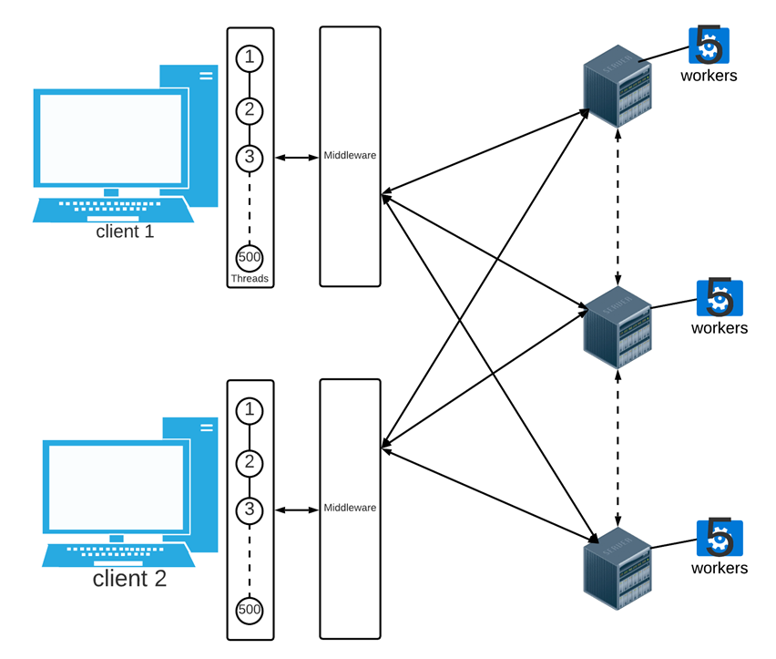

# What is this?
This is a simple Server and Client made in Rust which uses UDP. If you want to run, make sure to have [Rust](https://www.rust-lang.org/tools/install) installed first.
* Important! You will have to manuallly update the ip addresses in both the client and server.
* There is a report that contains a much more detailed explanation of the project.

## Credits:
This was a university project, it was done with a group of three (me included!). Thanks for Ahmed Shaaban and N42at <3.

# Server(s):
There are two variations for the server. One does load balancing using round robin. The Other uses a threshold algorithm.

## To Run:
    $cargo Run <arg1> <arg2>

The Server takes in two arguments:
* arg1: is the server id (please make sure to start from 0).
* arg2: is the fileName that will store logs about the server.

# Client(s):
The Client is a process which spawns 503 threads, 500 simulating different client applications, 2 threads for middleware and a thread for logging info.

## To Run:
    $cargo run <arg1> <arg2> <arg3>

The Client takes in three arguments:
* arg1: is the port the middleware will use to send messages/requests from.
* arg2: is the port the middleware will use to recieve and send messages/announcments from and to other middlewares.
* arg3: is the fileName that will store logs about the client.

# Report

# Distributed Systems Project Report

## Team Members
- **Abdullah Nashat Salman**   
- **Ahmad Shaaban**  
- **Abdelrahman Reda Abdelmonem** 

## Design
  
*A simplified diagram of the system showing different nodes and their connections.*

### **Client Side**
The client is implemented as a **single process with 503 threads**:
- **`500` threads** represent client applications:
  - Each thread executes an infinite loop, sending messages to the middleware thread and blocking for a reply.
  - Every 20 seconds, a thread logs its metrics (requests made, latency, etc.) to the logging thread.
- **`2` middleware threads**:
  - **First thread**: Handles incoming messages from client threads.
    - Uses round-robin to send requests to servers.
    - Implements a 3-second timeout for server replies.
    - Replies to the client thread with either the server's response or a failure message (-1).
  - **Second thread**: Handles announcements from other middleware agents (e.g., server down notifications).
    - Updates the list of available servers.
- **`1` logging thread**:
  - Logs thread metrics, calculates averages, and writes data to a file every 20 seconds.

**Communication**: Rust's native `Channels` are used for thread communication, supporting synchronous/asynchronous messaging with multiple producers and a single consumer.

---

### **Server Side**
The server is implemented as a **single process with `n+3` threads** (where `n = 5` worker threads):
- **`n` worker threads**:
  - Each worker listens/blocks on a shared channel where jobs are queued. Once a job is available, it will try to consume and execute, and returns to blocking.
  - The channel uses a mutex lock for thread-safe access.
- **`1` listener thread (main)**:
  - Blocks on `get_request`, queues incoming requests for workers.
  - Handles "down-announcement" messages:
    - If the server's ID matches the downed server's ID, it sleeps for `SLEEP_TIME`.
    - Stops the election trigger thread to ensure only one server is down at a time.
  - Measures load (requests/sec) and multicasts updates under threshold load balancing.
- **`1` election trigger thread**:
  - Attempts to start an election every `TRY_START_ELECTION_FREQ` ms with a `START_ELECTION_PROBABILITY` chance.
  - If triggered, sends an election message to the next server in the ring.
- **`1` logging thread**:
  - Logs server load every second and downtime events.
  - Maintains the 100 most recent log entries.

**Shared Variables**: Server ID, load, and server states are shared across threads using `Arc` pointers with mutexes for write operations.

## Algorithms
### **Load Balancing**
#### Round Robin
- Each client middleware iterates over the server list in a loop.
- Requests are sent to the next available server.

#### Round Robin + Threshold
- Servers classify their load into three levels:
  - **0 (Underloaded)**: 0–5000 req/sec  
  - **1 (Medium)**: 5000–7500 req/sec  
  - **2 (Overloaded)**: 7500+ req/sec  
- Servers multicast load updates every second. Overloaded servers forward requests to underloaded peers if possible.

### **Distributed Election**
#### Ring Algorithm
- Servers are arranged in a logical ring.
- An election trigger thread may start an election, propagating a message around the ring.
- The message collects server IDs and random values; the initiator selects the server with the highest value to go down.
- The chosen server sleeps for `SLEEP_TIME` (10 sec), and an announcement is multicast to all nodes.

## Assumptions & Limitations
- **Client**:
  - Each thread blocks for replies with a 3-second timeout.
- **Server**:
  - Fixed 5 worker threads.
- **Threshold**:
  - Load levels are predefined; down servers cannot update their status.
- **Election**:
  - Only one server can be down at a time.
  - Downed servers stop listening but finish pending requests.

## Changes & Updates
### **Client Side**
- Evolved from a simple UDP client to a multithreaded system with:
  - 500 client threads.
  - Middleware for request handling and announcements.
  - Logging for performance metrics.

### **Server Side**
- Expanded from a basic UDP server to include:
  - Thread pools for request handling.
  - Election and threshold load-balancing logic.
  - Logging for load and downtime.

## Issues & Obstacles
### **Design Issues**
- Initially planned separate client/middleware processes but switched to threads due to Rust's IPC complexity.
- Solved thread-to-thread reply challenges by creating 500 dedicated channels.

### **Technical Issues**
- Global variable management.
- Error handling (e.g., underflow/overflow).
- Marshaling and time measurement complexities.

## Metrics & Performance
| Test Case               | Latency (ms) | Throughput (req/sec) | Failed Requests | Avg Load (0/1/2) |
|-------------------------|--------------|-----------------------|------------------|-------------------|
| 2 Clients, Round Robin | 61           | 8108                  | 1                | 4997/6630/7225    |
| 1 Client, Round Robin  | 44           | 11140                 | 1                | 5681/6100/3989    |
| 2 Clients, Threshold   | 66           | 7459                  | 13               | 19791/12932/6466  |
| 1 Client, Threshold    | 44           | 11082                 | 1                | 4645/4200/4400    |

### **Discussion**
- **1 vs 2 Clients**: Fewer clients yield lower latency and higher throughput.
- **Threshold vs Round Robin**: Threshold added overhead without performance gains in this simple system. Round robin was more efficient.
